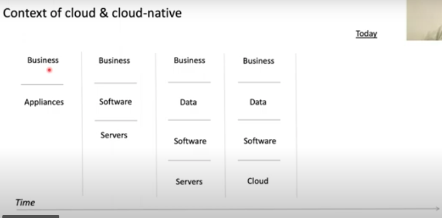
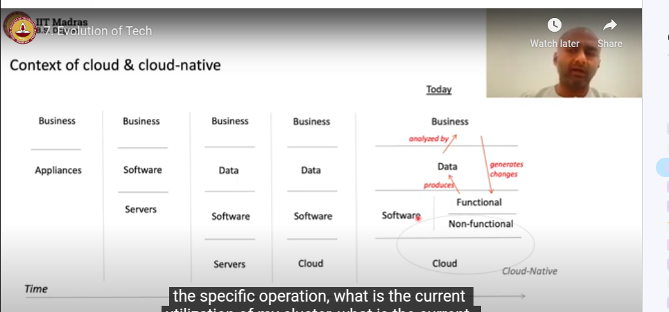

appliances 
    - are applications for special purposes, catering to special business problems
    - not general purpose
    - eg: Atm
    - eg: Home Appliances
        - smart ac, smart fridge, smart tv, smart washing machine
        - thermostat  - which is a device that can be controlled remotely and can be programmed to adjust the temperature of your home at different times of the day

- over a period of time, the cost of maintaining the appliances is more than the cost of the appliance itself

- chips were general purpose, and become cheap
- moore's law - the number of transistors on a chip doubles every 2 years
- some softwares started producing telemetries, which can be used to monitor the health of the appliance
    - telemetry - the process of recording and transmitting the readings of an instrument
        - captures what is happening in the appliance 
        
